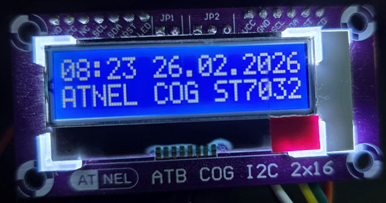

# ATNEL COG 2x16 - ST7032i I2C Character LCD - ESPHome Component

Custom ESPHome component for ST7032i based COG (Chip On Glass) character LCD displays.
Native I2C communication - no PCF8574 expander needed.

Designed for **ATB COG I2C 2x16** display module by [ATNEL](https://atnel.pl).
buy on:
https://sklep.atnel.pl/pl/p/Wyswietlacz-alfanumeryczny-2x16-I2C-ATNEL-COG-Chip-On-Glass-/292



## Features

- Native I2C (no expander, no extra GPIO - just SDA + SCL)
- Programmable contrast 0-63 (no potentiometer needed)
- User-defined characters (CGRAM, 8 positions)
- Standard ESPHome display API: `print`, `printf`, `strftime`
- Optional hardware reset pin (RST)
- Works on ESP8266 and ESP32

## Hardware

### I2C Address

| Format            | Address |
|-------------------|---------|
| 7-bit (ESPHome)   | `0x3E`  |
| 8-bit (datasheet) | `0x7C`  |

### Wiring

```
ATB COG 2x16       ESP
-------------       ---
SDA  -------------- SDA (GPIO4 ESP8266 / GPIO21 ESP32)
SCL  -------------- SCL (GPIO5 ESP8266 / GPIO22 ESP32)
VCC  -------------- 3.3V
GND  -------------- GND
RST  -------------- GPIO (optional, directly to VCC if not used)
```

## Installation

### Local component

Copy the `components/atnel_cog_2x16_st7032` folder into your ESPHome project directory:

```
your_project/
  your_config.yaml
  components/
    atnel_cog_2x16_st7032/
      __init__.py
      display.py
      atnel_cog_2x16_st7032.h
      atnel_cog_2x16_st7032.cpp
```

Add to YAML:

```yaml
external_components:
  - source:
      type: local
      path: components
```

### From GitHub

```yaml
external_components:
  - source:
      type: git
      url: https://github.com/atnel/atnel_cog_component
      ref: main
```

## Configuration

```yaml
display:
  - platform: atnel_cog_2x16_st7032
    id: my_lcd
    address: 0x3E            # default, can be omitted
    contrast: 32             # 0-63, default 32
    columns: 16              # default 16
    rows: 2                  # default 2
    update_interval: 1s      # how often lambda is called
    reset_pin: GPIO16        # optional - only if RST pin is connected
    user_characters:         # optional - up to 8 custom chars
      - position: 0
        data: [0x06, 0x09, 0x09, 0x06, 0x00, 0x00, 0x00, 0x00]
    lambda: |-
      it.print(0, 0, "Hello World!");
```

### Parameters

| Parameter          | Required | Default | Description                    |
|--------------------|----------|---------|--------------------------------|
| `address`          | no       | `0x3E`  | I2C address (7-bit)            |
| `contrast`         | no       | `32`    | Display contrast 0-63          |
| `columns`          | no       | `16`    | Number of columns              |
| `rows`             | no       | `2`     | Number of rows                 |
| `update_interval`  | no       | `5s`    | Lambda refresh interval        |
| `reset_pin`        | no       | -       | GPIO pin connected to RST      |
| `user_characters`  | no       | -       | Custom character definitions   |
| `lambda`           | no       | -       | Rendering function             |

## Lambda API

### Text Output

```cpp
it.print("Hello");                          // at current cursor position
it.print(0, 0, "Line 1");                   // at column, row
it.print(0, 1, "Line 2");

it.printf("Val: %d", my_int);               // formatted output
it.printf(0, 1, "T: %.1f C", temp);         // formatted at position

it.strftime("%H:%M:%S", id(my_time).now()); // time formatting
it.strftime(0, 0, "%H:%M", id(my_time).now());
```

**Cursor continuation** - `print()` without coordinates continues from where
the previous call left off. This allows building output step by step:

```cpp
it.print(0, 1, "Temp:");
it.print(" 21.5");           // continues right after "Temp:"
it.print("\x80");            // degree symbol (CGRAM pos 0)
it.print("C");               // final "C"
```

### Display Control

```cpp
it.clear();                  // clear entire display
it.clear_line(0);            // clear line 0 (top)
it.clear_line(1);            // clear line 1 (bottom)
it.set_cursor(5, 0);        // move cursor to column 5, row 0
it.cursor_on();              // show underline cursor
it.cursor_off();             // hide cursor
it.blink_on();               // blinking block cursor
it.blink_off();              // stop blinking
it.set_contrast_value(40);   // change contrast at runtime (0-63)
```

## User-Defined Characters (CGRAM)

Up to 8 custom characters (positions 0-7). Each character is 5x8 pixels,
defined as 8 bytes where lower 5 bits represent pixel columns.

### Definition in YAML

```yaml
user_characters:
  - position: 0                # degree symbol
    data: [0x06, 0x09, 0x09, 0x06, 0x00, 0x00, 0x00, 0x00]
  - position: 1                # thermometer
    data: [0x04, 0x0A, 0x0A, 0x0E, 0x0E, 0x1F, 0x1F, 0x0E]
  - position: 2                # antenna
    data: [0x00, 0x0E, 0x04, 0x04, 0x04, 0x04, 0x0E, 0x04]
  - position: 3                # droplet (humidity)
    data: [0x04, 0x04, 0x0A, 0x0A, 0x11, 0x11, 0x11, 0x0E]
```

### CGRAM Address Mapping (0x80 - 0x87)

In C/C++ strings, byte value `0x00` acts as a null terminator and cuts the
string short. This component uses an original remapping technique from the
MK_LCD library by ATNEL to solve this problem elegantly:

**CGRAM characters are addressed using codes `0x80` - `0x87` in strings,
which the driver automatically remaps to hardware CGRAM positions 0 - 7.**

| CGRAM Position | Code in string | Note                                   |
|----------------|----------------|----------------------------------------|
| 0              | `\x80`         | MUST use 0x80 (0x00 = null terminator) |
| 1              | `\x81`         | or simply `\x01`                       |
| 2              | `\x82`         | or simply `\x02`                       |
| 3              | `\x83`         | or simply `\x03`                       |
| 4              | `\x84`         | or simply `\x04`                       |
| 5              | `\x85`         | or simply `\x05`                       |
| 6              | `\x86`         | or simply `\x06`                       |
| 7              | `\x87`         | or simply `\x07`                       |

Positions 1-7 can use either the short form (`\x01` - `\x07`) or the mapped
form (`\x81` - `\x87`). Position 0 **must** use `\x80`.

**Important:** When a hex escape like `\x01` is followed by a valid hex
character (a-f, A-F, 0-9), C++ treats them as one escape sequence.
For example `\x01C` becomes byte `0x1C` (not char 1 + letter C).
Always split the string in such cases:

```cpp
it.printf(0, 0, "21.5\x80" "C");   // correct: degree (pos 0) + letter C
it.printf(0, 0, "21.5\x80C");      // WRONG: 0x80C is not what you want!
```

The safest universal approach - use `0x80`-`0x87` range and split before
any hex-valid letter (A-F, a-f, 0-9):

```cpp
it.printf(0, 0, "\x81 21.5\x80" "C");    // thermometer + temp + degree + C
it.printf(0, 1, "\x83 65%%");             // droplet + humidity (safe, % is not hex)
```

## Complete Example

```yaml
external_components:
  - source:
      type: local
      path: components

time:
  - platform: sntp
    id: sntp_time
    timezone: Europe/Warsaw

display:
  - platform: atnel_cog_2x16_st7032
    id: my_cog_lcd
    address: 0x3E
    contrast: 32
    columns: 16
    rows: 2
    update_interval: 1s
    user_characters:
      - position: 0               # degree symbol
        data: [0x06, 0x09, 0x09, 0x06, 0x00, 0x00, 0x00, 0x00]
    lambda: |-
      // Line 0: time + date
      if( id(sntp_time).now().is_valid() ) {
        it.strftime(0, 0, "%H:%M", id(sntp_time).now());
        it.strftime(6, 0, "%d.%m.%Y", id(sntp_time).now());
      } else {
        it.print(0, 0, "--:--  --.--.----");
      }
      // Line 1: label + temperature with degree symbol
      it.printf(0, 1, "ST7032    21.5\x80" "C");
```

## Technical Notes

- Contrast is set programmatically via I2C - no potentiometer needed
- Backlight on COG displays is controlled via separate GPIO (not through I2C)
- The display buffer is cleared before each lambda call (`update_interval`)
- I2C frequency 400kHz works well; the display supports up to 600kHz
- After follower circuit init, 200ms stabilization delay is applied automatically

## Based On

MK_LCD ver 3.0 library by Miroslaw Kardas ([ATNEL](https://atnel.pl)) -
originally written for AVR microcontrollers, ported to ESPHome C++ component.

## License

MIT
